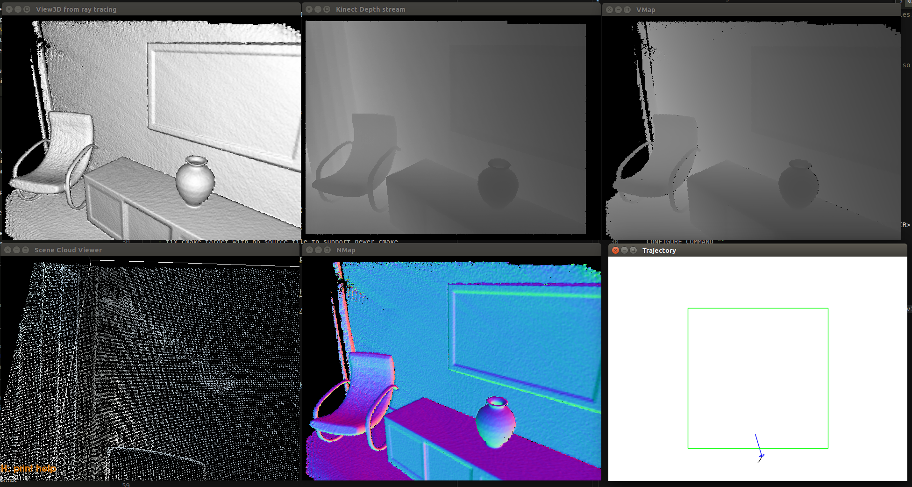

# StanfordPCL

Fork of Qianyi's StanfordPCL for Ubuntu 18.04 + CUDA 11.

- Build system change: [9893fa8](https://github.com/yxlao/StanfordPCL/commit/9893fa80d0a593183bab41a29fc476405b525789)
- Source code change: [8b07f1c](https://github.com/yxlao/StanfordPCL/commit/8b07f1c2cc0a7e97c67fa602c3fa8033134e251a)

## Environment

- Ubuntu 18.04
- CUDA 11.0
- gcc/g++ 7.5
- gcc/g++ 4.8
- CMake 3.20

## Dependencies

Dependencies are built automatically within the `deps` folder, so that it won't
pollute your system environment. One exception is OpenNI, where we'll install
by `apt-get`.

Here's the list of dependencies:

- Boost
  - `1.50.0`: download the zip file from official website, the tar file does not
    contain build scripts
  - requires `toolset=gcc-4.8`
- Eigen
  - `3.0.0`: https://gitlab.com/libeigen/eigen/-/archive/3.0.4/eigen-3.0.4.zip
- Flann
  - `1.8.0`: https://github.com/flann-lib/flann/releases/tag/1.8.0-src
  - modified
    - fix cmake target with no source file to support newer cmake
- OpenCV
  - `2.3.1`: https://github.com/opencv/opencv/archive/refs/tags/2.3.1.tar.gz
- OpenNI
  - `1.5.4`: installed with `apt-get`
- SuiteSparse
  - `5.10.1`: https://github.com/DrTimothyAldenDavis/SuiteSparse/archive/refs/tags/v5.10.1.tar.gz
- VTK
  - `v5.6.1`: https://github.com/Kitware/VTK/archive/refs/tags/v5.6.1.zip
  - modified
    - added `#include <cstddef>` patch
    - requires gcc 4.8

## Build instructions

```bash
# Dependencies for SuiteSparse
sudo apt-get install libmpc-dev liblapack-dev libopenblas-dev

# Dependencies
sudo apt install libopenni-dev

# Build dependencies
cd deps
mkdir build
cd build
cmake ..
make -j$(nproc)
cd ../..

# Build main library
mkdir build
cd build
cmake ..
make pcl_kinfu_largeScale -j$(nproc)
./bin/pcl_kinfu_largeScale
```

## Running the example

```bash
# Download an example .oni file
# Checkout http://redwood-data.org/indoor/tutorial.html for more data
cd sandbox
wget https://github.com/yxlao/StanfordPCL/releases/download/oni-files/input.oni
wget https://github.com/yxlao/StanfordPCL/releases/download/oni-files/longrange.param
cd ..

cd build
./bin/pcl_kinfu_largeScale -r -ic -sd 10 -oni ../sandbox/input.oni -vs 4 --fragment 25 --rgbd_odometry --record_log 100-0.log --camera ../sandbox/longrange.param
```

If everything goes correctly, you shall see:



## Additional notes: formatting

This repo has been formatted with the following commands. This is done to
show what modified cleanly. Check out the commit history for the list of
changes after formatting.

```bash
# CRLF to LF
find . -not \( -name .svn -prune -o -name .git -prune \) -type f -exec dos2unix {} \;

# Remove trailing space
find . -not \( -name .svn -prune -o -name .git -prune \) -type f -print0 | xargs -0 perl -pi -e 's/ +$//'

# clang-format
echo "BasedOnStyle: LLVM\nIndentWidth: 4\nSortIncludes: false" > .clang-format
find 2d 3rdparty apps cmake common cuda doc examples features filters geometry \
    gpu io kdtree keypoints ml mobile_apps octree outofcore recognition \
    registration sample_consensus search segmentation simulation stereo \
    surface test tools tracking visualization \
    -iname *.h -o -iname *.cpp -o -iname *.cc -o -iname *.cu -o -iname *.hpp -o -iname *.cuh | xargs clang-format-10 -i
```

## Additional notes: OpenNI manual configuration

If for some reason, you have to build OpenNI from source, here's how to do it:

```bash
# Get https://github.com/yxlao/OpenNI.git, branch ubuntu
# Fixed: `equivalent -> is_equivalent` to support newer compiler
cd Platform/Linux/Build
cd ../../../
make -j6

cd Platform/Linux/CreateRedist
./RedistMaker
cd ../../../

cd Platform/Linux/Redist/OpenNI-Bin-Dev-Linux-x64-v1.x.x.
sudo ./install.sh
sudo ./install.sh -u  # To uninstall
```

Typically we install OpenNI in the system level, rather than giving it a custom
install prefix due to its hard-coded config file paths. For instance, it assumes
a config file `/var/lib/ni/modules.xml`

## Original notes

```txt
===============================================================================
=                          Qianyi Zhou's PCL Fork                             =
===============================================================================

I have been receiving requests for the source code of
pcl_kinfu_largeScale_release.exe, which is a critical module in the robust
scene reconstruction system we have developed.

Project: http://qianyi.info/scene.html
Code: https://github.com/qianyizh/ElasticReconstruction
Executable system: http://redwood-data.org/indoor/tutorial.html

Thus I publish my fork of PCL here as a reference.

===============================================================================

Disclaimer

I forked PCL from an early development version three years ago, and have made
numerous changes. This repository is an image of my personal development chunk.
It contains many experimental functions and redundant code.

THERE IS NO GUARANTEE THIS CODE CAN BE COMPILED OR USED. WE DO NOT INTEND TO
PROVIDE ANY SUPPORT FOR THIS CODE. IT SHOULD BE USED ONLY AS A REFERENCE.

If you are looking for the official PCL, go to this repository:
https://github.com/PointCloudLibrary/pcl

===============================================================================

License

As part of the scene reconstruction system, the code of this repository is
released under the MIT license.

Some parts of this repository are from different libraries:

Original PCL - BSD license
SuiteSparse - LGPL3+ license (we have a static library linked by Visual Studio)
Eigen - MPL2 license (we have a copy of a certain version of Eigen)
```
